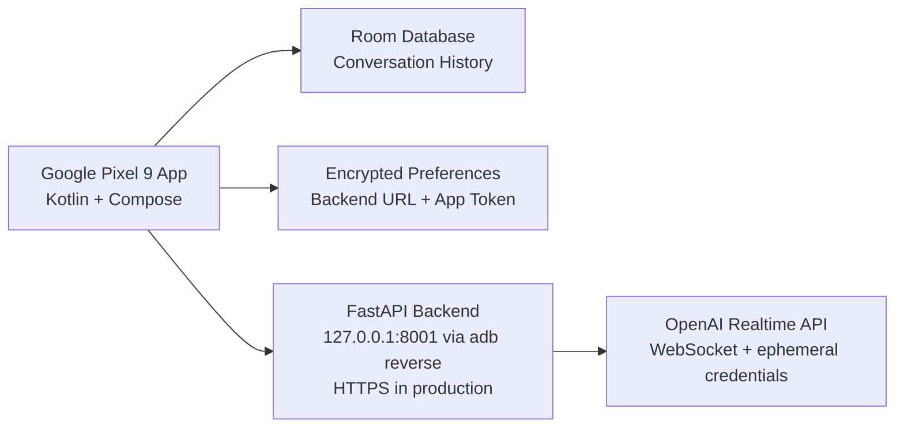

# Duddy Translator Architecture

## Android

- Kotlin
- Jetpack Compose
- Material 3
- Room database
- Encrypted settings
- OkHttp networking (REST + WebSocket)
- Coroutines and Flow
- Realtime engines: on-device speech (default) and an OpenAI Realtime WebSocket
  client streaming PCM16 audio via Android AudioRecord/AudioTrack

## Backend

- FastAPI
- `OPENAI_API_KEY` stored server-side only
- `/health`
- `/api/realtime/client-secret`
- `/api/realtime/call`

## Realtime Flow

1. Android requests a temporary Realtime credential from the FastAPI backend.
2. Backend calls OpenAI Realtime client-secret/session endpoints using the standard server-side API key.
3. Backend returns a short-lived client secret to Android.
4. Android opens a WebSocket to the OpenAI Realtime API with that client secret,
   streams microphone audio (PCM16 24 kHz) as `input_audio_buffer.append`, and plays
   the `response.output_audio.delta` frames back through AudioTrack. Transcript events
   provide the original and translated text.
5. Android stores conversation messages locally in Room.

## Pixel 9 Runtime

- Physical Pixel 9 default backend URL: `http://127.0.0.1:8001`
- USB development uses `adb reverse tcp:8001 tcp:8001`
- Emulator backend URL: `http://10.0.2.2:8000`
- Portrait UI wraps controls for the Pixel 9 1080 x 2424, 20:9 display.

## Production Notes

- Use HTTPS in deployed backend environments.
- Replace the default `dev-local-token`.
- Keep token expiration short.
- Use Android audio APIs for echo cancellation, noise suppression, and Bluetooth routing.
