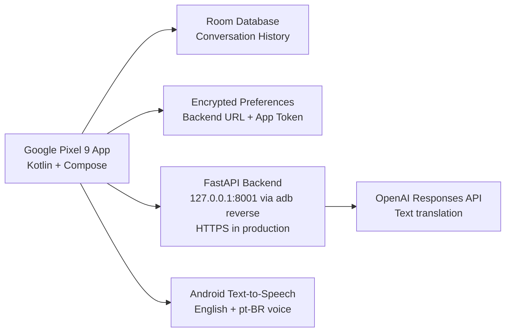

# Duddy Translator Architecture

## Android

- Kotlin
- Jetpack Compose
- Material 3
- Room database
- Encrypted settings
- OkHttp networking (REST)
- Coroutines and Flow
- Android SpeechRecognizer for English and Brazilian Portuguese input
- Android Text-to-Speech for spoken translated output

## Backend

- FastAPI
- `OPENAI_API_KEY` stored server-side only
- `/health`
- `/api/translate/text`

## Realtime Flow

1. Android listens through SpeechRecognizer in the selected speaker language.
2. Android sends the recognized phrase to `/api/translate/text`.
3. Backend calls the OpenAI Responses API with the server-side API key.
4. Android stores the original and translated text locally in Room.
5. Android Text-to-Speech speaks the translated phrase in the target language.

## Pixel 9 Runtime

- Physical Pixel 9 default backend URL: `http://127.0.0.1:8001`
- USB development uses `adb reverse tcp:8001 tcp:8001`
- Emulator backend URL: `http://10.0.2.2:8000`
- Portrait UI wraps controls for the Pixel 9 1080 x 2424, 20:9 display.

## Production Notes

- Use HTTPS in deployed backend environments.
- Replace the default `dev-local-token`.
- Keep token expiration short.
- Use Android audio APIs for echo cancellation, noise suppression, and Bluetooth routing.
