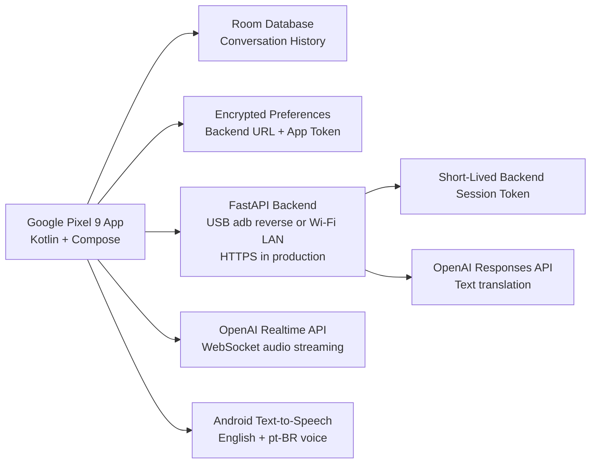

# Duddy Translator Architecture

## Android

- Kotlin
- Jetpack Compose
- Material 3
- Room database
- Encrypted settings
- OkHttp networking (REST)
- Coroutines and Flow
- Android SpeechRecognizer for English and Brazilian Portuguese input
- Android Text-to-Speech for spoken translated output
- Experimental AudioRecord/WebSocket/AudioTrack streaming engine
- Offline medical phrasebook fallback for SCC/Mohs terms and critical typed
  backup phrases
- Separated Android voice pipeline:
  - `SpeechRecognizerClient` handles Android speech recognition and partial transcripts.
  - `TranslationRepository` owns text translation requests.
  - `TtsPlayer` owns Android Text-to-Speech playback.
  - `ConversationController` coordinates push-to-talk and continuous turns.
  - `RealtimeAudioStreamingTranslatorClient` handles experimental AudioRecord -> VAD -> Realtime WebSocket -> AudioTrack.

## Backend

- FastAPI
- `OPENAI_API_KEY` stored server-side only
- `/health`
- `/api/auth/session-token`
- `/api/translate/text`
- `/api/realtime/client-secret`

Protected Android/backend calls use short-lived backend session tokens. The app
token is only a bootstrap credential for `/api/auth/session-token`; translation
and realtime session calls use `Authorization: Bearer <session_token>`.

## Realtime Flow

1. Android listens through SpeechRecognizer in the selected speaker language.
2. Android shows partial transcripts while listening, but waits for a final committed phrase before translating.
3. Android sends the recognized phrase to `/api/translate/text`.
4. Backend calls the OpenAI Responses API with the server-side API key.
5. If the backend path fails in Medical or Travel mode and Offline Medical
   Fallback is enabled, Android uses the on-device medical phrasebook.
6. Android stores the original and translated text locally in Room when Save
   Conversation History is enabled.
7. Android Text-to-Speech speaks the translated phrase in the target language.

## Production Direction

Push-to-talk remains the default production mode because it gives the user clear
control over turn boundaries and avoids accidental always-on recording. The
Android app now separates speech recognition, translation, text-to-speech, and
conversation orchestration so a streaming path can be added without replacing the
whole app.

The backend realtime endpoints now support an experimental AudioRecord -> VAD ->
WebSocket streaming path. They are still not the stable Pixel 9 default. Keep the
Streaming Speech Engine setting off for normal use until latency, interruption,
Bluetooth, echo, and noisy-room behavior have been validated on hardware.

Recommended next streaming path:

1. Capture microphone audio with `AudioRecord`.
2. Run client-side VAD to detect speech and silence.
3. Stream 20 ms PCM chunks over WebSocket using backend-issued ephemeral credentials.
4. Display partial transcripts while delaying final translation until a commit threshold.
5. Play translated speech as chunks arrive, with per-message replay and retry.

## Pixel 9 Runtime

- Physical Pixel 9 USB backend URL: `http://127.0.0.1:8001`
- USB development uses `adb reverse tcp:8001 tcp:8001`
- Cable-free Pixel 9 Wi-Fi URL: `http://<PC LAN IP>:8001` from `.\scripts\run-backend.ps1 -Lan`
- Emulator backend URL: `http://10.0.2.2:8001`
- 5G-first runtime: enable Prefer Cellular Data and use a public HTTPS backend URL.
  Local/private backend URLs stay on the local route so USB, emulator, LAN, and
  hotspot setups keep working.
- Quick travel runtime: `scripts\run-backend-travel.ps1` runs the FastAPI backend
  on localhost, exposes it through a public HTTPS Cloudflare quick tunnel, saves
  the URL to `logs\travel-backend-url.txt`, and `scripts\install-pixel9-travel.ps1`
  builds the Pixel app with that URL and cellular preference enabled.
- Permanent São Paulo runtime: `scripts\deploy-backend-cloudrun.ps1` deploys the
  backend to Cloud Run in `southamerica-east1`, stores API secrets in Secret
  Manager, saves the stable service URL to `logs\cloudrun-backend-url.txt`, and
  `scripts\install-pixel9-cloudrun.ps1` installs a Pixel build pinned to that
  stable HTTPS backend.
- Portrait UI wraps controls for the Pixel 9 1080 x 2424, 20:9 display.

## Production Notes

- Use HTTPS in deployed backend environments.
- Replace the default `dev-local-token`.
- Keep token expiration short.
- Use the Cloud Run deployment for trips where the phone must work without the
  home PC or home Wi-Fi.
- Use Android audio APIs for echo cancellation, noise suppression, and Bluetooth routing.
- Keep conversation history opt-in unless the app uses an encrypted transcript store and clear retention policy.
